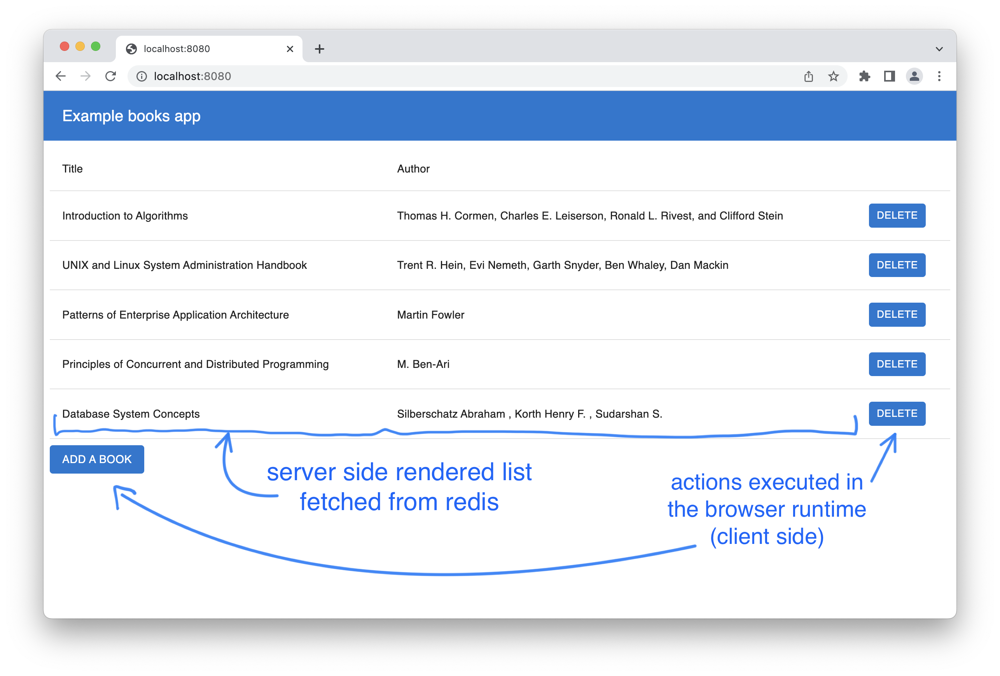
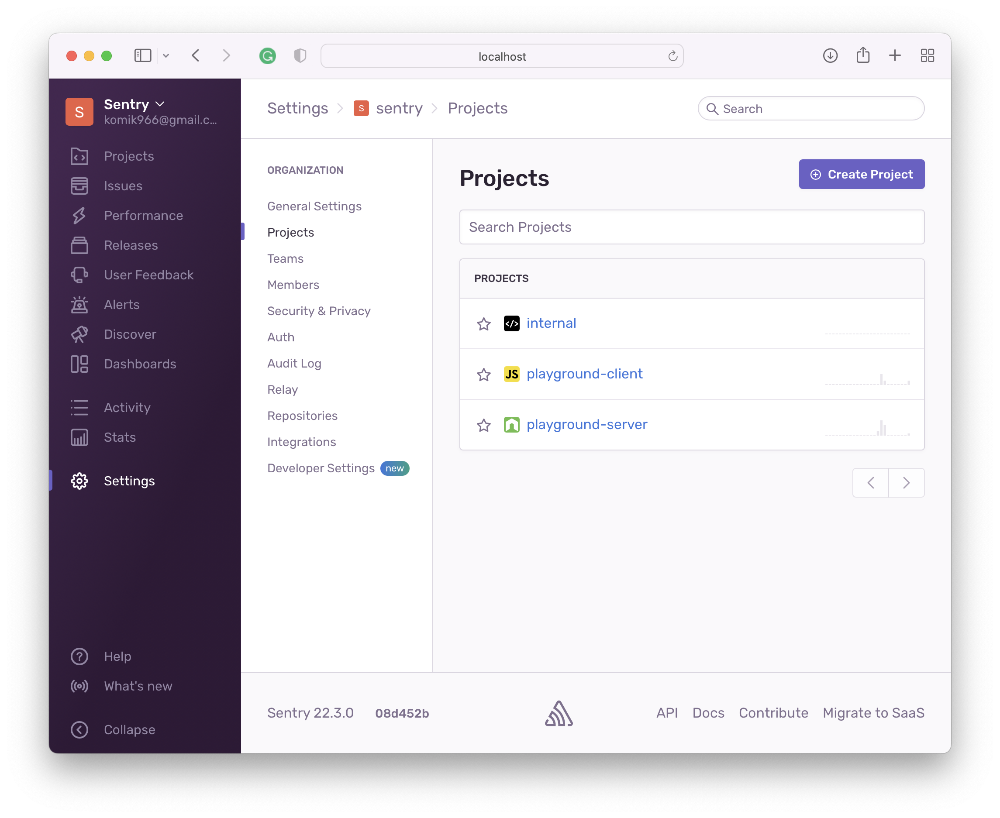
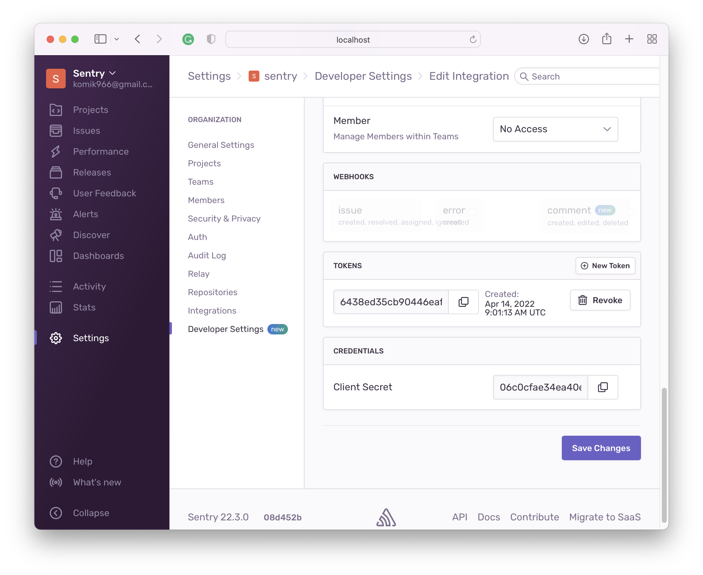
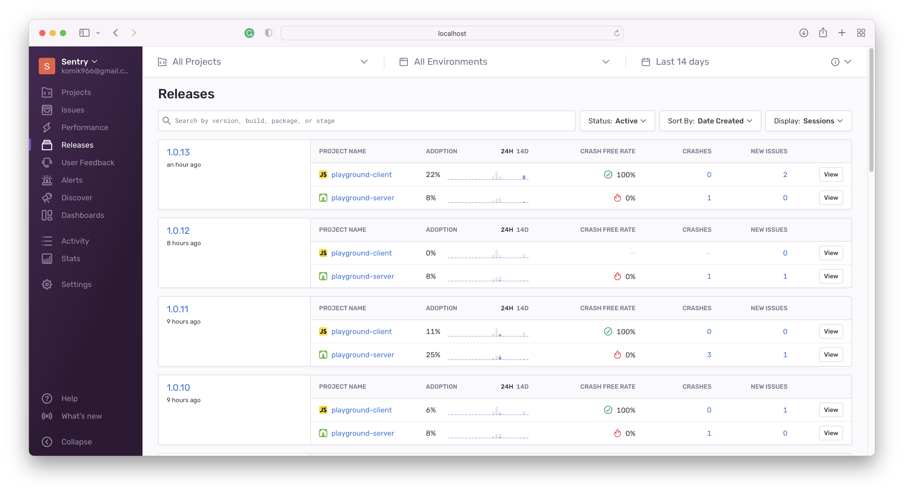
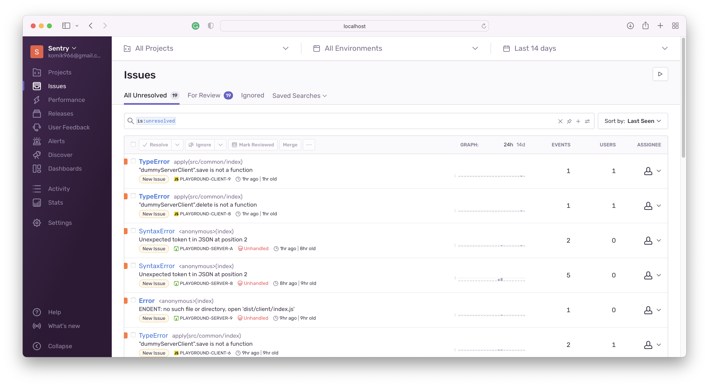
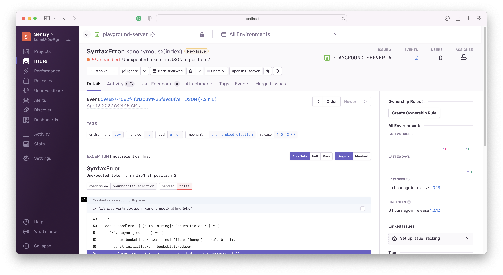
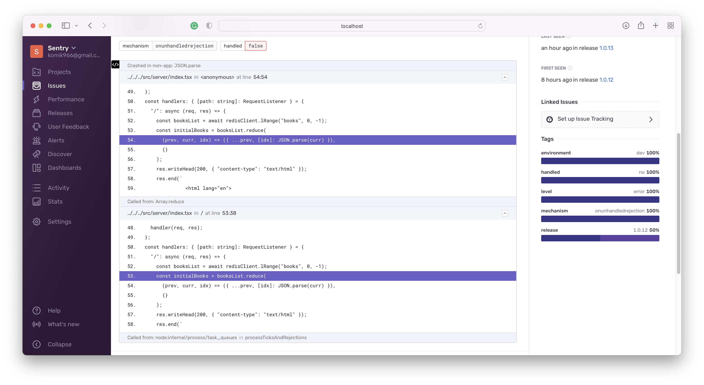
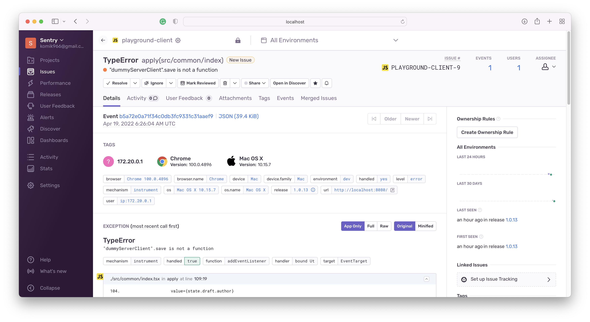
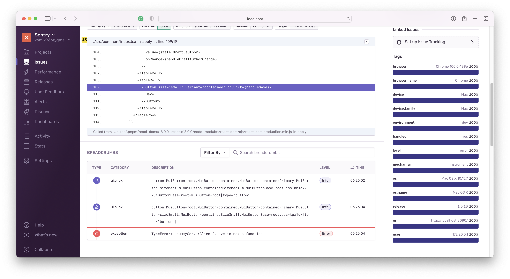
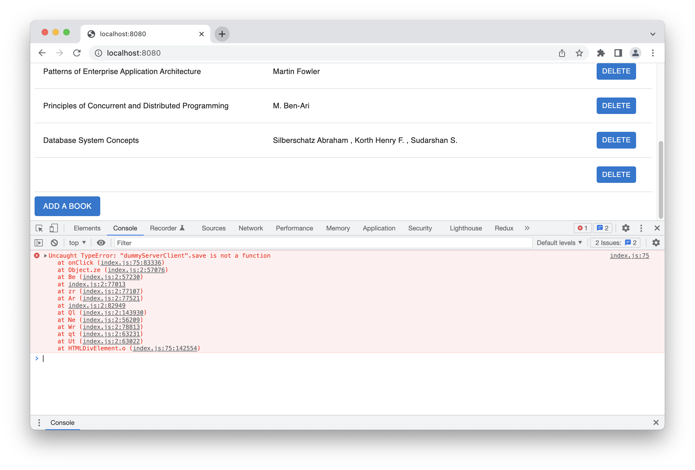

# Sentry demo
This project contains simple books list app with Sentry configuration.

App uses server-side rendering as well as some browser-side handlers.

It's just pure react and node, no frameworks, to check how things work on the "low level".

App uses redis to keep the books list.



## Sentry setup
Please note that there are several ways to configure sentry integration.
The following is one of them.

### Run Sentry instance locally
Follow the steps in the [Getting Started paragraph](https://develop.sentry.dev/self-hosted/#getting-started)
Everything should work out of the box.
### Create projects
Server side logs will be sent to the `playground-server` project.

Browser side logs will be sent to the `playground-client` project.


### Create internal integration
Internal integration is needed to get the auth token which will be used
by the [sentry-cli](https://docs.sentry.io/platforms/node/sourcemaps/uploading/cli/) to create a new release.


### Add integration code
[Server side:](https://docs.sentry.io/platforms/node/)

```
const env = {
  scheme: "http",
  host: "localhost",
  port: 8080,
  name: "dev",
  release: process.env.SENTRY_RELEASE || "0.0.0",
  rewriteFramesRoot:
    "/Users/konradmikucki/projects/sandbox/appmonitoring/dist/server",
};

Sentry.init({
  dsn: "http://ea891f87c434400cba10905cb4c6a398@localhost:9000/6",
  environment: env.name,
  release: env.release,
  integrations: [new RewriteFrames({ root: env.rewriteFramesRoot })],
});
```

Properties reference:

- [dsn](https://docs.sentry.io/platforms/node/configuration/options/#dsn) - value should be copied from the project settings
- [environment](https://docs.sentry.io/platforms/node/configuration/environments/)
- [release](https://docs.sentry.io/platforms/node/configuration/releases/#setting-a-release) - proper release is needed to match sourcemaps
- [RewriteFrames](https://docs.sentry.io/platforms/node/sourcemaps/best-practices/#adjusting-frames) - needed to properly match stack traces against source maps


[Client side:](https://docs.sentry.io/platforms/javascript/)

```
Sentry.init({
  dsn: "http://81bfabc06c584435b8d7d6373f1e6a38@localhost:9000/7",
  environment: window.SENTRY_ENVIRONMENT,
  release: window.SENTRY_RELEASE,
  integrations: [new BrowserTracing()],
});
```

### Build a new release
#### Create `.sentryclirc` file:
```
[defaults]
url=http://localhost:9000
org=sentry
[auth]
token=6438ed35cb90446eaf7bd6620ac752b01bccd8aa10e64f5390d27c1f934e0b2d
```

[Other options for storing config or secrets are available.](https://docs.sentry.io/product/cli/configuration/)

#### Compile with sourcemaps: 
```
npx babel -s -x .ts,.tsx ./src/server -d dist/server/server
npx babel -s -x .ts,.tsx ./src/common -d dist/server/common
npx webpack --env production
```

#### Create new releases
```
npx sentry-cli releases -p playground-server new 2.0.0
npx sentry-cli releases -p playground-server files 2.0.0 upload-sourcemaps dist/server
npx sentry-cli releases -p playground-server finalize 2.0.0


npx sentry-cli releases -p playground-client new 2.0.0
npx sentry-cli releases -p playground-client files 2.0.0 upload-sourcemaps dist/client
npx sentry-cli releases -p playground-client finalize 2.0.0
```

## Take a look into the Sentry





### Same stack trace - Sentry vs browser console:





